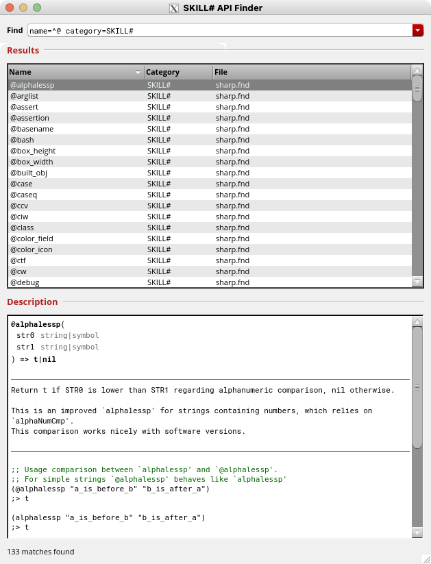

<pre>
 ________  ___  __    ___  ___       ___           ___    ___           
|\   ____\|\  \|\  \ |\  \|\  \     |\  \         |\  \  |\  \          
\ \  \___|\ \  \/  /|\ \  \ \  \    \ \  \      __\_\  \_\_\  \_____    
 \ \_____  \ \   ___  \ \  \ \  \    \ \  \    |\____    ___    ____\   
  \|____|\  \ \  \\ \  \ \  \ \  \____\ \  \___\|___| \  \__|\  \___|   
    ____\_\  \ \__\\ \__\ \__\ \_______\ \_______\ __\_\  \_\_\  \_____ 
   |\_________\|__| \|__|\|__|\|_______|\|_______||\____    ____   ____\
   \|_________|                                   \|___| \  \__|\  \___|
                                                        \ \__\ \ \__\   
                                                         \|__|  \|__|   
</pre>
<!---
Generated using https://www.asciiart.eu/text-to-ascii-art

Modified version below but it does not appear properly on all browsers...
<pre style='font-family: "Courier New", Courier, monospace; line-height: 0.567;'>
◥■■■■■■■◣ ◥■■◣ ◥■■◣  ◥■■◣ ◥■■◣     ◥■■◣         ◥■■◣   ◥■■◣
 ◥■■◣░░░░  ◥■■◣◢■■◤   ◥■■◣ ◥■■◣     ◥■■◣      ◥■■■■■■■■■■■■■■■◣
  ◥■■■■■■■◣ ◥■■■■■■■■◣ ◥■■◣ ◥■■◣     ◥■■◣      ░░░◥■■◣░░░◥■■◣░░
   ░░░░░◥■■◣ ◥■■◣░░◥■■◣ ◥■■◣ ◥■■◣     ◥■■◣         ◥■■◣   ◥■■◣
         ◥■■◣ ◥■■◣  ◥■■◣ ◥■■◣ ◥■■■■■■◣ ◥■■■■■■■◣ ◥■■■■■■■■■■■■■■■◣
   ◥■■■■■■■■■◣ ░░░   ░░░  ░░░  ░░░░░░░  ░░░░░░░░  ░░░◥■■◣░░░◥■■◣░░
    ░░░░░░░░░░                                        ░░░    ░░░
</pre>
-->

# SKILL#
Cadence SKILL++ Enhanced Framework


## Introduction
SKILL# offers out-of-the-box tools for novice users, including:

- Advanced Lint rules
- Code formatting (#TODO)

For advanced users, it also provides:

- Unit-Testing Framework
- Documentation Generation
- Fully Specified, Documented and Tested API
- Macros to target design patterns and reduce human error
- On-Demand (lazy or strict) Type-Checking


## Requirements

### To Use

SKILL# mostly relies on `$CDS_INST_DIR/tools.lnx86/dfII/bin/skill` interpreter.  
Of course it also works within Virtuoso.

> [!NOTE]
>
> If Virtuoso is installed and `$CDS_INST_DIR` is defined, everything should work fine.

### To Develop

For development and testing, SKILL# relies on Open-Source projects:

- [GNU Make](https://github.com/mirror/make)
- [shellspec](https://github.com/shellspec/shellspec) ≥ 0.28.1
- [shellcheck](https://github.com/koalaman/shellcheck) ≥ 0.10.0
- [fd](https://github.com/sharkdp/fd)
- [scc](https://github.com/boyter/scc)


## Usage

### Standalone
The `bin/sharp` utility provides the following commands:

| Command         | Documentation                                                             |
|-----------------|---------------------------------------------------------------------------|
| `sharp help`    | Display available commands and arguments.                           #TODO |
| `sharp lint`    | Run Lint with advanced rules on all files from provided paths.            |
| `sharp test`    | Load files from provided paths and print test report.                     |
| `sharp globals` | Load files from provided paths and report global definitions.             |
| `sharp docgen`  | Load files from provided paths and print associated `.fnd` documentation. |
| `sharp format`  | Pretty print the contents of files from provided paths.             #TODO |
<!---
| `sharp blunt`   | Print files from provided paths without SKILL# dependencies.        #TODO |
-->

> [!NOTE]
>
> _"files from provided paths"_ refers to `{.il, .ils, .scm}` files found using `find` on all paths provided as arguments (files or directories).
>
> Command output is simply printed to `stdout`, while errors and warnings are printed to `stderr`.


### Inside Virtuoso
To enable the full SKILL# API inside Virtuoso, load the following command or place it in your `.cdsinit` file:
```scheme
(load (simplifyFilename "$SKILL_SHARP_ROOT/skill/loader.scm"))
```

> [!NOTE]
>
> Replace $SKILL_SHARP_ROOT with the path to this repository's root directory.

Once loaded, the API is directly available and can be browsed in native "SKILL Finder" tool:
<a name="SKILL_Finder">&nbsp;</a>




## Features

### Advanced Lint Rules

SKiLL# provides advanced Lint rules that are useful to debug code.
Those rules are also good examples to write more, don't hesitate to have a look at `skill/autoloaded/lint.scm` and add your own rules.

When loaded in Virtuoso SKILL# Lint rules are enabled by default, you can disable them by setting shell variable `$SKILL_SHARP_NO_LINT_RULES` to "TRUE".

#### Waiver

In some tricky cases Lint rules are annoying as they can report valid code as errors.
(Or some might write weird or dirty code on purpose!)

SKILL# provides two ways to waive lint rules:

```scheme
;; Native SKILL compliant waiver
(progn "NO_LINT" (car (setof elt (list 1 2 3) (evenp elt))))

;; SKILL# waiver
(@no_lint (car (setof elt (list 1 2 3) (evenp elt))))
```

> [!NOTE]
>
> It is often better to waive warnings instead of degrading valid code to make it compliant.


#### Detect unused local functions

#TODO


##### Report missing docstrings

SKILL# report missing docstrings in `defun`, `defglobalfun`, `procedure`, `globalProc`, and `defmethod`.


#### Other hints and custom rules

SKILL# also gives advice when better practices can be easily used:

For instance `(car (setof ...))` can almost always be replaced by `(car (exists ...))` for improved performances.
(Except when `setof` body is destructive, which is not very recommended...)


### Unit-Testing

SKILL# provides a unit-testing framework including two statements `@test` and `@assertion`:

`@test` is used to gather assertions and associate them with a given function.

`@assertion` is used to run S-expressions and make sure catched output, info, warnings and errors are matching the provided ones.

```scheme

(defun print_hello_world_and_return_12 (name "t")
  "Print 'Hello World!' said by NAME and return 12."
  (info "%s says 'Hello World! to poport'\n" name)
  (warn "%s says 'Hello World! to woport'\n" name)
  12)

(@test
  ?fun 'print_hello_world_and_return_12

  (@assertion
    ?doc "Works with John"
    (print_hello_world_and_return_12 "John")
    ?out 12
    ?info "John says 'Hello World!' to poport"
    ?warn "John says 'Hello World!' to woport"
    )

  (@assertion
    ?doc "Fails with a symbol"
    (print_hello_world_and_return_12 'John_as_a_symbol)
    ?error "print_hello_world_and_return_12: argument #1 should be a string"
    )

  )

```

### Type-Checking

SKILL# provides on-demand Type-Checking.
It can be lazy (only done when specified, for instance during testing) or strict.

The SHELL variable `$SKILL_SHARP_STRICT_TYPE_CHECKING` Can be set to "TRUE" to enable strict checking.
Otherwise it is lazy by default.

All the type checking is managed by the `@fun` macro, it is enabled (or not) at macro expansion time.

```scheme

;; Here type-checking is always disabled

(@fun convert_to_string
  ( ( name ?type symbol )
    )
  ?doc    "Convert NAME to a string and return it."
  ?out    string
  ?strict nil
  (strcat name)
  )

;; Here type-checking is always enabled
;; Input can be a float or an integer
;; Output has to be a float

(@fun double
  ( ( num ?type float|integer )
    )
  ?doc    "Return the double of NUM as a float."
  ?out    float
  ?strict t
  ( num * 2.0 )
  )

;; Here type-checking depends on $SKILL_SHARP_STRICT_TYPE_CHECKING value
;; when `@fun' macro is expanded (before function is defined)!

(@fun join
  ( ( char    ?type symbol|string         )
    @rest
    ( strings ?type ( symbol|string ... ) )
    )
  ?doc "Join STRINGS using CHAR as junction character."
  ?out string
  (buildString strings char)
  )
```

Please read `@fun` documentation for detailled syntax of `?type` and `?out` arguments.


### Documentation Generation

SKILL# allows to generate Finder documentation from native SKILL or SKILL++ code.

It takes in account functions and methods arguments, type strings and docstrings.

Of course it works even better if you use `@fun`, `@test` and `@assertion` as more details are taken in account
and generated documentation includes more data.

The generated documentation uses HTML for a prettier rendering than default .fnd files, while remaining compatible with the native SKILL Finder.

You can see the example <a href="#SKILL_Finder">here</a>.


### Design Patterns

SKILL# provides advanced functions and macros to handle properly patterns that are often found in code.

Most of them are inspired by other languages (Python, Common-Lisp, ...) but implemented in SKILL++.


#### F-Strings

Python f-strings are brilliant as they reduce human errors.
`lsprintf` syntax works in most cases but when placeholders are numerous, it becomes harder to maintain.

F-strings guarantee that the code between the bracket corresponds to what will be evaluated, there is no placeholder shift error possible.

With SKILL# you can write the following code:

```scheme
(@str "The result of 12 plus 27 is {12+27}.)")

(@str "
The current shell is {(getShellEnvVar \"SHELL\")}.
The current time is {(getCurrentTime)}.
")

;; You can even use `fprintf` formatting syntax to shape output.
;; For instance to print only a specific number of decimals for a float.
;; Or to use `printself` or not.

(defclass example_class ())
(defmethod printself ( ( obj example_class ) )
  (lsprintf "example_class[%N]" obj)
  )

pi = (acos -1)
obj = (makeInstance 'example_class)

(@str "
This is pi with four decimals: {pi%0.4f}. \n\
Object without `printself` {obj%N}.       \n\
Object using `printself` {obj%A}.         \n\
The default is without `printself` {obj}. \n\
")
```

It also works within `@info`, `@warn`, `@error`, and `@fprintf`.


#### Letf

It is very common to set and revert a switch or a value.
`@letf` takes advantage of `setf` to set anything temporarily.

```scheme
;; It is very dangerous to use `simplifyFilename` without setting `rexMagic`.


;; When `rexMagic` is set to nil, `simplifyFilename` returns placeholders instead
;; of variables values
(rexMagic nil)
(simplifyFilename "$SHELL")

;; Here we temporarily set `rexMagic` and revert it back.
(@letf ( ( (rexMagic) t )
         )
  (simplifyFilename "$SHELL")
  )

;; `rexMagic` value is still nil.
(rexMagic)


;; `@letf` works with any `setf` helper
(@letf ( ( (rexMagic)                         nil    )
         ( (getShellEnvVar "CUSTOM_VARIABLE") "TRUE" )
         ( (status optimizeTailCall)          t      )
         )
  (list (rexMagic) (getShellEnvVar "CUSTOM_VARIABLE") (status optimizeTailCall))
  )


```


#### With

#TODO


### Improved 'SKILL# API Finder'

When loading SKILL#, you can now access an improved version of the 'SKILL API Finder'.
It works using the same variable `$CDS_FINDER_PATH` and files (.fnd & .tgf) as the native finder.

The improved finder enables searching in the function name, arguments and description.
With the same search argument, it often gives more results than the default 'SKILL API Finder'.
Those results however can be narrowed down using advanced search.
It also offers the flexibility to only search in the function names (or arguments, or descriptions).

